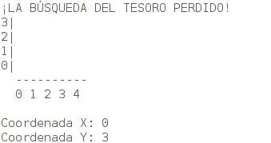
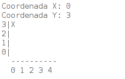
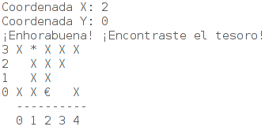

# La Búsqueda del Tesoro Perdido

> Juego de la Búsqueda del Tesoro Perdido realizado en clase de Programación como ejercicio complementario de arrays bidimensionales.

## Explicación
Es un simple juego en el que al iniciarse aparecerá el tablero de juego inicial y nos pedirá que introduzcamos una coordenada X y una coordenada Y, tal que así:

En el caso de dar en un punto en el que no se encuentra ni la *MINA* ni el *TESORO*, nos aparecerá una X:

Cuando encontremos la MINA o el TESORO, el juego acabará y nos aparecerá el tablero con todos nuestros intentos y la posición de la MINA(*) y el TESORO(€):

¡Y eso sería todo! Simplemente es un ejercicio complementario para reforzar los conocimientos de arrays bidimensionales en JAVA.

> :star: Si te ha gustado este ejercicio, dale una estrellita al [repositorio](https://github.com/ismaelpacheco13/busqueda-tesoro).

